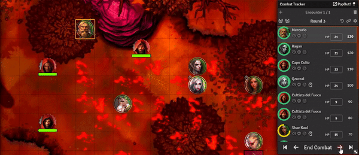
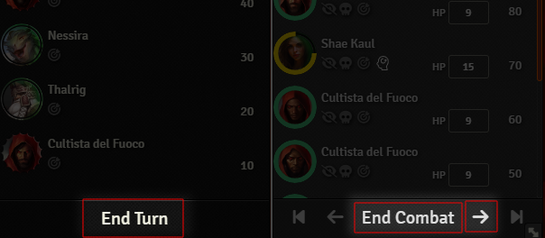
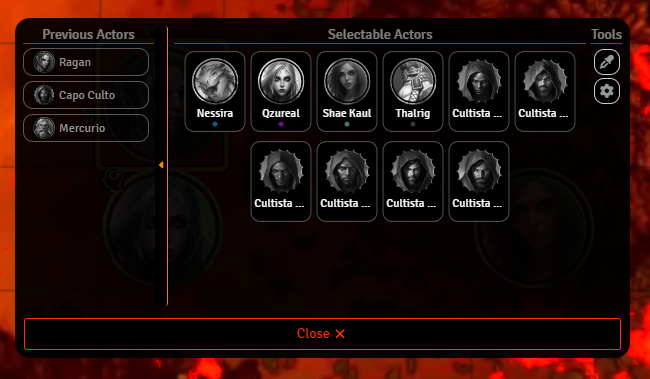

# Just... Popcorn Initiative

---

An alternative approach to combat sequencing. Rather than relying on standard initiative, it allows players and GMs to
designate the subsequent combatant at the conclusion of their turn.

### Reason

I've recently come across the 'Popcorn Initiative' as an alternate method to add some excitement to my D&D session. My
group enjoys playing a crunchy system, but we're also open to incorporating narrative choices into our battles.
Unfortunately, Foundry VTT doesn't offer a built-in way for this (at least not for D&D 5e). So, I went ahead and created
this module to fill in the missing functionality.

### Credits

This package is built w/ the [TyphonJS Runtime Library](https://github.com/typhonjs-fvtt-lib/typhonjs)

### How it works?

Once you've got the module enabled, the "End Turn" and "Next Turn" buttons on the combat tracker will behave
differently. When you use them to move the current actor's turn, a Selection Window will pop up for the player or GM to
make their choice.

**Overridden Buttons**

**Selection Window**

### Selection Window

The Selection Window is split into three sections:

- Selectable Actors:
   - This displays a list of actors that haven't taken their turn in this round, allowing you to choose from them.
- Previous Actors:
   - A recap of all the actors who have already completed their turn in this round.
- Tools:
   - Several options designed to assist in selecting the next actor.

### Settings

|                       Setting                       |                                                                                                                Description                                                                                                                |
|:---------------------------------------------------:|:-----------------------------------------------------------------------------------------------------------------------------------------------------------------------------------------------------------------------------------------:|
|     Override "Next Turn" and "End Turn" button      |                                                    Turn on/off the overridden behaviour for those buttons in case they conflict or we want to use a macro to show the Selection Window                                                    |
| Allow Self Selection at the start of the next round | Activate the option for a player to independently select themselves as the subsequent participant for consecutive rounds. This provides the player with the ability to maintain their position in the ongoing sequence if they so desire. |
|              Let the Last actor choose              |                                                                                        Enable last actor to choose first combatant of next round.                                                                                         |
|                Selection Window size                |                                                                                  Select the size of the window from these two presets. ( Normal, Mini )                                                                                   |
|              Selection Window position              |                                                                                               Select the position of the selection window.                                                                                                |
|                Install common Macros                |                                      New macros will be added to your libraries. One is used to select the next actor in the combat tracker and the other one used to open the configuration window                                       |

### Compatibility Issues

Any ruleset that ties an initiative value to the actor should work smoothly without any problems.
Anyway I still need to thoroughly test this module, especially regarding its interaction with other modules that depend
on turns/rounds for tracking effects and time. Once I identify specific issues, I'll make sure to list them.

### Under the Hood

This module is quite straightforward. It tweaks the initiative values of each actor according to the choice made when
the player/GM ends their turn.
